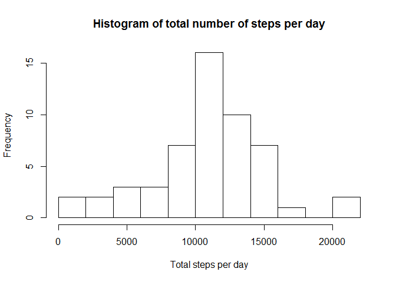
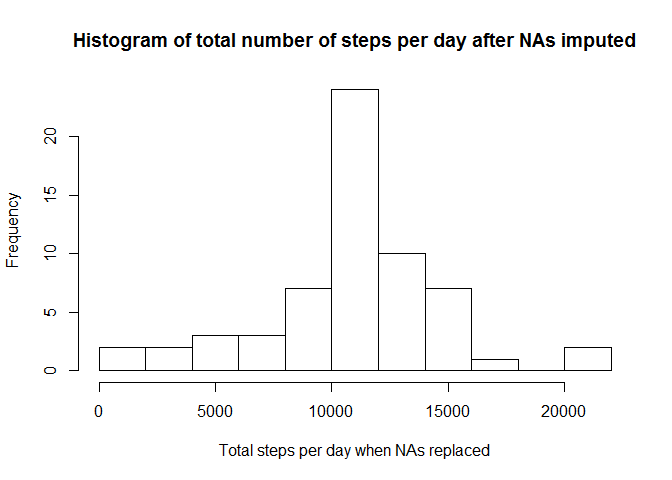
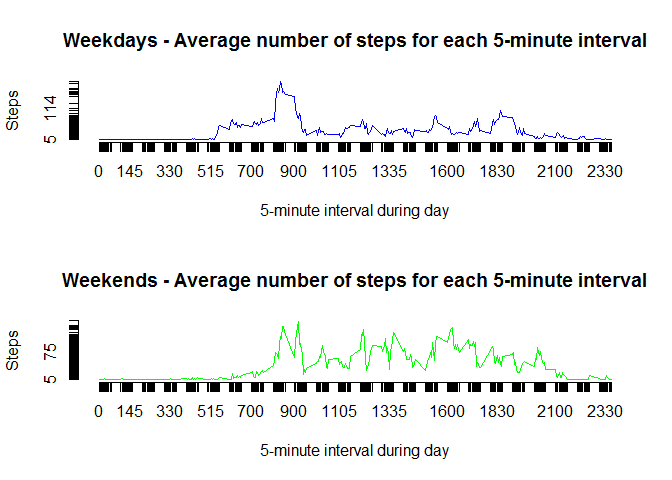

# Reproducible Research: Peer Assessment 1
Robert Ross - 2015.01.18


## Loading and preprocessing the data


```r
  ## setup
  setwd("~/Coursera/5-Reproducible Research/Assignment1/github/RepData_PeerAssessment1")
  library(dplyr)
```

```
## 
## Attaching package: 'dplyr'
## 
## The following object is masked from 'package:stats':
## 
##     filter
## 
## The following objects are masked from 'package:base':
## 
##     intersect, setdiff, setequal, union
```

```r
  library(ggplot2)
  
  ## read the data files from the activity Dataset
  moves <- read.csv("./activity.csv")
  
  ## get a subset of rows without the NA values for steps
  moves.noNA <- moves[complete.cases(moves),]
  
  ## sum up total steps taken each day
  moves.daily <- moves.noNA %>% group_by(date) %>% summarise(sum(steps))
```

### What does the data look like?


```r
  ## show first 6 rows of data
  head(moves)  
```

```
##   steps       date interval
## 1    NA 2012-10-01        0
## 2    NA 2012-10-01        5
## 3    NA 2012-10-01       10
## 4    NA 2012-10-01       15
## 5    NA 2012-10-01       20
## 6    NA 2012-10-01       25
```

## What is mean total number of steps taken per day?


```r
  ## make histogram of total number of steps per day
  names(moves.daily)[2]="steps"
  hist(moves.daily$steps, 
       main="Histogram of total number of steps per day", 
       xlab="Total steps per day",
       breaks=10)
```

 

```r
  ## calculate mean and median for daily steps
  moves.daily.mean <- mean(moves.daily$steps)
  moves.daily.median <- median(moves.daily$steps)
```

#### The mean of the total number of steps taken per day is 1.0766189\times 10^{4}.


#### The median of the total number of steps taken per day is 10765.


## What is the average daily activity pattern?


```r
  ## figure out and plot the daily activity pattern
  moves.daily.activity <- aggregate(steps ~ interval, data=moves.noNA, mean)
  moves.daily.activity$interval <- as.character.Date(moves.daily.activity$interval)

  plot(moves.daily.activity$interval, moves.daily.activity$steps, 
       type="l", 
       main="Average number of steps for each 5-minute interval",
       xlab="5-minute interval during day", 
       ylab="Steps", 
       col="blue", 
       axes=F)
       axis(side=1, at=moves.daily.activity$interval)
       axis(side=2, at=round(moves.daily.activity$steps,0))
```

 

### Most active 5-minute interval


```r
  ## figure out the most active average 5-minute period in the day
  most.steps <- round(moves.daily.activity[moves.daily.activity$steps == max(moves.daily.activity$steps), 2],0)
  most.steps.time <- moves.daily.activity[moves.daily.activity$steps == max(moves.daily.activity$steps), 1]
```

#### The 5-minute interval with the most activity (average of 206)     is at the  835 interval.


## Imputing missing values


```r
  ## calculate number of rows in raw data with NA
  moves.NA <- nrow(moves) - nrow(moves.noNA)
```

#### The total number of missing values (NAs) in the dataset is 2304.

#### The strategy for NAs is to replace them all with the average number of steps per interval for all of the non-NA rows. This is a very simple strategy that should not change the mean value, but will likely change the median value (at least a little bit).


```r
  ## calculate average number of steps per interval for non-NA rows
  ave.steps.per.interval <- sum(moves.noNA$steps) / nrow(moves.noNA)

  ## make a copy of original data and replace NAs with ave steps/interval
  moves.replaceNA <- moves
  moves.replaceNA[is.na(moves.replaceNA)] <- ave.steps.per.interval

  ## redo the histogram, mean and median for new dataset with NAs replaced
  ## sum up total steps taken each day
  moves.daily.replaceNA <- moves.replaceNA %>% group_by(date) %>% summarise(sum(steps))

  ## make histogram of total number of steps per day with NAs replace
  names(moves.daily.replaceNA)[2]="steps"
  hist(moves.daily.replaceNA$steps, 
       main="Histogram of total number of steps per day after NAs imputed", 
       xlab="Total steps per day when NAs replaced",
       breaks=10)
```

 

```r
  ## calculate mean and median for daily steps
  moves.daily.replaceNA.mean <- mean(moves.daily.replaceNA$steps)
  moves.daily.replaceNA.median <- median(moves.daily.replaceNA$steps)

  ## calculate difference between this mean and median and the no-NA values
  mean.diff <- moves.daily.mean - moves.daily.replaceNA.mean
  median.diff <- moves.daily.median - moves.daily.replaceNA.median
```

#### The mean of the total number of steps taken per day is 1.0766189\times 10^{4}.


#### The median of the total number of steps taken per day is 1.0766189\times 10^{4}.


#### The difference between the mean of the total number of steps taken per day with no NA values vs. replacing the NAs with the average steps per interval is 0 (which is kind of expected:-).


#### The difference between the median of the total number of steps taken per day with no NA values vs. replacing the NAs with the average steps per interval is -1.1886792. This happens because several days have no values (all NAs), and therefore every interval gets replaced with the same average, causing all of these days to have the same total number of steps - so lots of identical "median" values to pick from.


## Are there differences in activity patterns between weekdays and weekends?


```r
  ## convert dates and "military time" to POSIXct times
  ## add new column representing a weekday or weekend day
  moves.replaceNA$interval.seconds <- ((moves.replaceNA$interval %/% 100) * 3600) + ((moves.replaceNA$interval %% 100) * 60)
  moves.replaceNA$date <- as.POSIXct(moves.replaceNA$date)
  moves.replaceNA$date.time <- moves.replaceNA$date + moves.replaceNA$interval.seconds
  moves.replaceNA$day.of.week=weekdays(moves.replaceNA$date.time)

  ## swap the weekday name for 'weekday' or 'weekend'
  moves.replaceNA$day.of.week <- gsub("Monday","weekday",moves.replaceNA$day.of.week)
  moves.replaceNA$day.of.week <- gsub("Tuesday","weekday",moves.replaceNA$day.of.week)
  moves.replaceNA$day.of.week <- gsub("Wednesday","weekday",moves.replaceNA$day.of.week)
  moves.replaceNA$day.of.week <- gsub("Thursday","weekday",moves.replaceNA$day.of.week)
  moves.replaceNA$day.of.week <- gsub("Friday","weekday",moves.replaceNA$day.of.week)
  moves.replaceNA$day.of.week <- gsub("Saturday","weekend",moves.replaceNA$day.of.week)
  moves.replaceNA$day.of.week <- gsub("Sunday","weekend",moves.replaceNA$day.of.week)
  
  ## create a factor with the days separated into weekday or weekend
  moves.replaceNA$day.of.week.fac <- factor(moves.replaceNA$day.of.week, labels=c("weekday","weekend"))

  ## final plot comparing activity on weekdays vs. weekends
  par(mfrow = c(2, 1))
  
  ## weekdays
  moves.weekday <- aggregate(steps ~ interval, data=subset(moves.replaceNA,day.of.week.fac=="weekday"), mean)
  moves.weekday$interval <- as.character.Date(moves.weekday$interval)
  
  plot(moves.weekday$interval, moves.weekday$steps, 
       type="l", 
       main="Weekdays - Average number of steps for each 5-minute interval",
       xlab="5-minute interval during day", 
       ylab="Steps", 
       col="blue", 
       axes=F)
  axis(side=1, at=moves.weekday$interval)
  axis(side=2, at=round(moves.weekday$steps,0))
  
  ## weekends
  moves.weekend <- aggregate(steps ~ interval, data=subset(moves.replaceNA,day.of.week.fac=="weekend"), mean)
  moves.weekend$interval <- as.character.Date(moves.weekend$interval)
  
  plot(moves.weekend$interval, moves.weekend$steps, 
       type="l", 
       main="Weekends - Average number of steps for each 5-minute interval",
       xlab="5-minute interval during day", 
       ylab="Steps", 
       col="green", 
       axes=F)
  axis(side=1, at=moves.weekend$interval)
  axis(side=2, at=round(moves.weekend$steps,0))
```

 

#### I think these graphs answer the question about whether there a difference between activity levels on weekdays and weekends (lots more activity on weekends)
